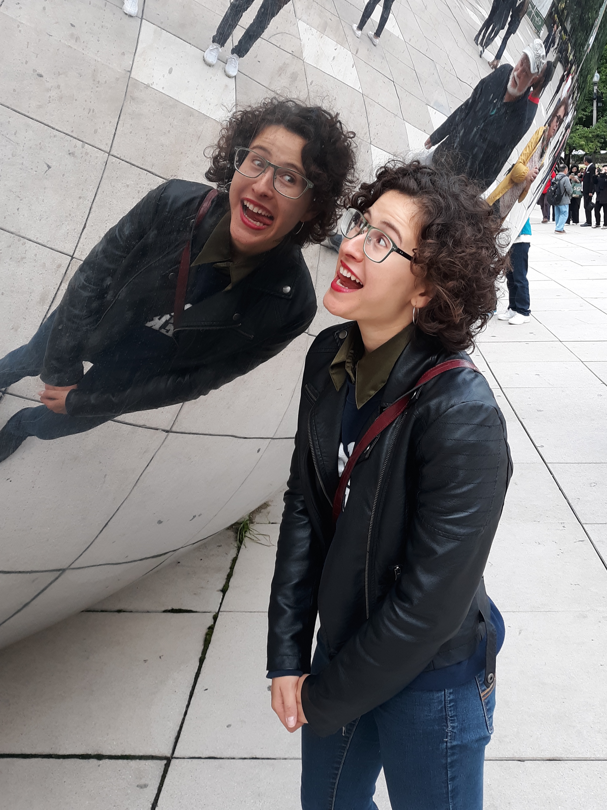

  <a href="https://carlykleinstern.github.io/KleinStern_CV_publish.pdf">
    <button>CV</button></a>
  <a href="https://carlykleinstern.github.io/aboutme.html">
    <button>About</button></a>
  <a href="https://carlykleinstern.github.io/projects.html">
    <button>Projects</button></a>

         

         
## **Carly KleinStern**

I'm a 3rd year Physics PhD student at the University of Chicago. I work with Prof. Elisabeth Moyer and Dr. Benjamin Clouser in the Department of Geosciences.

    

 
  My research is high-altitude in-situ water vapor and water vapor isotopologue measurements in the upper troposphere and lower stratosphere (UT/LS). 

### **Experience**
It's not been a straight shot to atmospheric sciences...my previous research experience is in:

- Experimental particle physics (direct dark matter detection using liquid and solid state detectors)
- Astrophysics (galaxy mergers)
- Astronomy (radio astronomy, X-shaped radio galaxies; optical astronomy, comets and asteroids)

You can find my CV [here](https://carlykleinstern.github.io/KleinStern_CV_publish.pdf).

### **Let's talk!**
Email: _cckleinstern@uchicago.edu_

<form
  action="https://formspree.io/f/mwkypbvd"
  method="POST"
>
  <label>
    Your email address:
    <input type="email" name="_replyto">
  </label>
   
   
   
  <label>
    Your message:
    <textarea name="message"></textarea>
  </label>
  <!-- your other form fields go here -->
   
  <button type="submit">Send</button>
</form>
