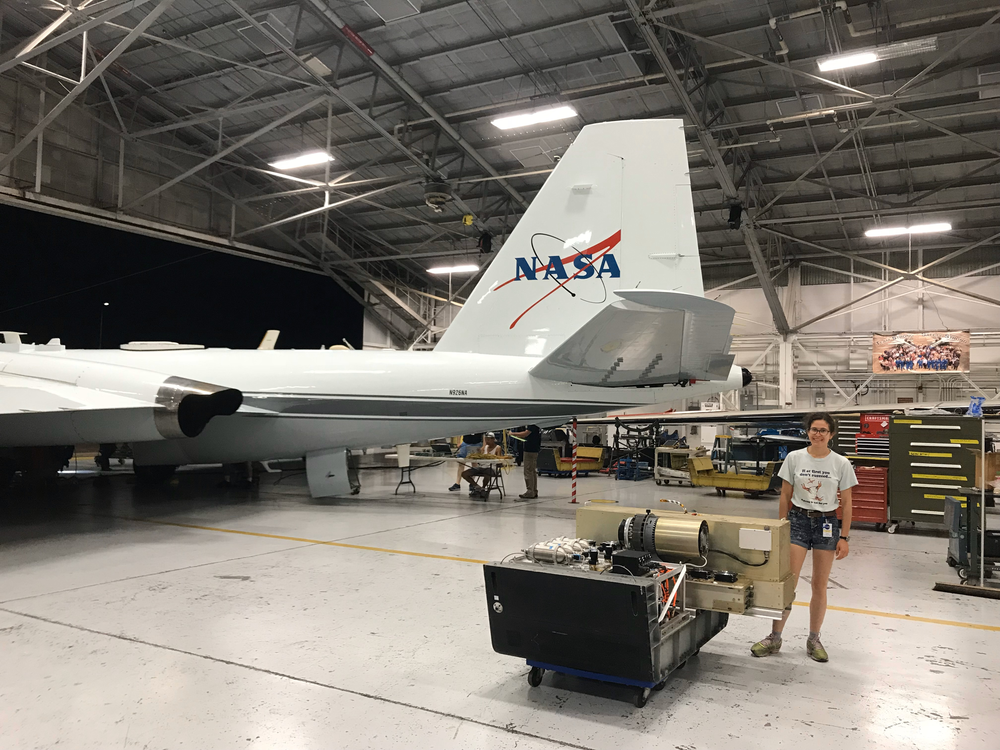

  <a href="https://carlykleinstern.github.io/KleinStern_CV_publish.pdf">
    <button style="height:60px;width:100px;color:#3b0c6e; font-weight:bold; border-color:#3b0c6e; background-color:White">CV</button></a>
  <a href="https://carlykleinstern.github.io">
    <button style="height:60px;width:100px;color:##0e1f6b; font-weight:bold; border-color:#0e1f6b; background-color:White">Home</button></a>
  <a href="https://carlykleinstern.github.io/projects.html">
    <button style="height:60px;width:100px;color:#0f5f6b; font-weight:bold; border-color:#0f5f6b; background-color:White">Research</button></a>
  <a href="https://carlykleinstern.github.io/aboutme.html">
    <button style="height:60px;width:100px;color: #0d782d; font-weight:bold; border-color: #0d782d; background-color:White">About</button></a>
  <a href="https://carlykleinstern.github.io/talks.html">
    <button style="height:60px;width:100px;color: #30c210; font-weight:bold; border-color: #30c210; background-color:White">Talks</button></a>

<b>Research</b>
 

**Chicago Water Isotope Spectrometer (ChiWIS-flight)**: This instrument flies aboard high-altitude research aircraft like the M-55 Geophysica and [NASA's WB-57](https://airbornescience.nasa.gov/aircraft/WB-57_-_JSC). It takes in-situ measurements of water vapor and water vapor isotopologues, primarily HDO. The ratio between water vapor and heavy water vapor can be used as a tracer of an air parcel's convective history. This summer we participated in NASA test flights in order to prepare for Summer 2022 [Asian Summer Monsoon Chemical and Climate Impact Project (ACCLIP)](https://www2.acom.ucar.edu/acclip) science flights, which will fly out of the Osan Air Base in South Korea and study how the Asian Summer Monsoon weather pattern transports water vapor and chemicals from the surface of the Earth into the stratosphere. 

    

**Chicago Water Isotope Spectrometer (ChiWIS-lab)**: This instrument interfaces with the [Aerosol Interaction and Dynamics in the Atmosphere (AIDA) ](https://www.imk-aaf.kit.edu/73.php) chamber to study cloud formation in a controlled environment.

